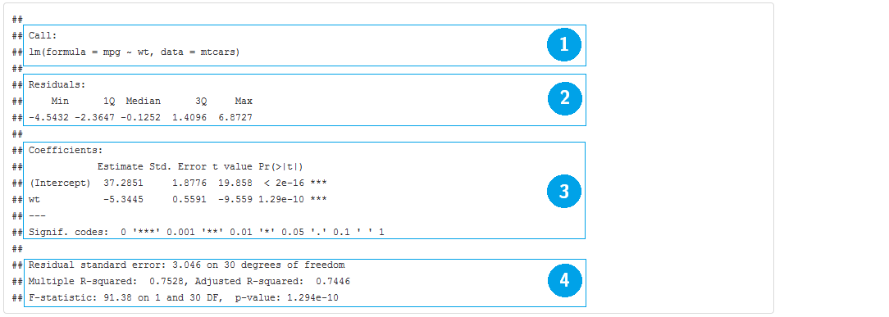

```{r, echo=FALSE, warning=FALSE, message=FALSE}
library(pander)
library(ggplot2)
library(magrittr)
library(tidyr)
library(dplyr)
panderOptions("table.style", "rmarkdown")
```

# Regressão Linear e ANOVA

O R tem todo o ferramentário necessário para fazer modelos lineares, a começar pelo modelo de regressão linear normal (Regressão/ANOVA/ANCOVA).
Para ilustrar, vamos utilizar a base de dados `mtcars` que vem no R.

Cada uma das 32 linhas da base `mtcars` representa um carro. A variável `mpg` é o consumo de combustível em milhas por galão (~3.76 Litros) e iremos tentar explicá-la pelas demais características dos veículos. 


## Um pouco de descritiva

### Univariada
```{r}
# os dados
head(mtcars)

# banco de dados das variáveis contínuas no formato "longo"
mtcars_long <- mtcars %>%  
  select(mpg, disp:qsec) %>%
  gather(var_continuas) 

# medidas resumo para variáveis contínuas
mtcars_long %>%
  group_by(var_continuas) %>%
  summarise("N" = n(),
            "Missing" = sum(is.na(value)),
            "Media" = mean(value),
            "DesvPad" = sd(value),
            "Minimo" = min(value),
            "Q1" = quantile(value, 0.25),
            "Mediana" = quantile(value, 0.50),
            "Q3" = quantile(value, 0.75),
            "Maximo" = max(value)) %>%
  mutate_each(funs(round(.,1)), -var_continuas)

# boxplots
mtcars_long %>%
  ggplot() +
  geom_boxplot(aes(x=1, y = value)) +
  facet_wrap(~var_continuas, scales = "free") 

# frequencias de variáveis categóricas
mtcars_freq <- mtcars %>%
  select(cyl, vs:carb) %>%
  gather(vars_categoricas) %>%
  rename(categoria = value) %>%
  group_by(vars_categoricas, categoria) %>%
  summarise(freq = n()) %>%
  group_by(vars_categoricas) %>%
  mutate(prop = freq/sum(freq),
         prop_txt = (prop*100) %>% round(0) %>% paste0("%"))

mtcars_freq

# Gráfico de barras
mtcars_freq %>%
  ggplot() +
  geom_bar(aes(x=categoria, y = freq), position = "dodge", stat = "identity") +
  facet_wrap(~vars_categoricas, scales="free")  
```

### Versus `mpg`

```{r}
# Matriz de correlação linear
mtcars %>%  
  select(mpg, disp:qsec) %>%
  cor %>%
  round(2) 

# Matriz de dispersão
pairs(mtcars %>%  
  select(mpg, disp:qsec))
```


## Regressão linear
A função que ajusta modelo linear normal no R é `lm()`. Você especifica o banco de dados e a fórmula com as variáveis que você deseja associar.

```{r, eval=FALSE}
ajuste <- lm(resposta ~ explicativas, data = meus_dados)
```

O objeto `ajuste` contém todos os resultados e com a ajuda de alguns comandos, você extrai tudo o que é interessante.

Exemplo:
```{r}
ajuste_lm <- lm(mpg ~ wt, data = mtcars)

ajuste_lm
```

No código acima temos `mpg` explicado por `wt`. A saída do `lm()` mostra qual foi a chamada do modelo e os coeficientes ajustados. Como visto na análise descritiva, há uma clara associação linear e negativa entre as variáveis, justificando o parâmetro negativo `wt = -5.344`. A função `coeficients()` ou `coef()` nos fornece os coeficientes ajustados.

Gráfico da reta ajustada:
```{r}
# extrai os coeficientes ajustados
coeficientes <- coef(ajuste_lm)

ggplot(mtcars) +
  geom_point(aes(x = wt, y = mpg)) +
  geom_abline(intercept = coeficientes[1], slope = coeficientes[2])
```

**summary()**

A função `summary()` é uma função genérica que geralmente devolve um resumo de informações úteis de praticamente qualquer classe de objetos. Para objetos `lm()` ela devolve:

1. Chamada do modelo
2. Medidas resumo dos resíduos
3. Tabela de coeficientes, desvios padrão e testes T para hipótese nula de parâmetros iguais a zero.
4. Média dos quadrados do resíduo e os respectivos graus de liberdade; $R^2$ e $R^2$ ajustado da regressão; Estatística F para qualidade do ajuste (comparação com o modelo com apenas o intercepto).

```{r, eval=FALSE}
summary(ajuste_lm)
```



**plot()**

A função `plot()` constrói gráficos úteis para diagnóstico do modelo.

```{r}
# opção para mostrar 4 gráficos em uma mesma figura
par(mfrow = c(2,2))

# gráficos de diagnóstico do modelo ajuste_lm
plot(ajuste_lm)

# retorna ao normal
par(mfrow = c(1,1))
```

**anova()**

Uma parte importante da modelagem é a redução de modelos. A função `anova()` compara dois (ou mais) modelos encaixados por meio da estatística F (por padrão), especialmente indicadas para modelos lineares normais. Caso seja passada apenas um ajuste à função, ela devolve a tabela de ANOVA (termos testados sequencialmente).

```{r}
# modelo nulo, com apenas o intercepto
ajuste_lm_nulo <- lm(mpg ~ 1, data = mtcars)

# modelo com wt e cyl
ajuste_lm2 <- lm(mpg ~ wt + factor(cyl), data = mtcars)

# compara o modelo com wt com o modelo nulo
anova(ajuste_lm_nulo, ajuste_lm)

# Tabela de ANOVA, testa os termos sequencialmente
anova(ajuste_lm2)
```

A o valor-p = 0.001064 indica que o modelo com `wt + cyl` trás melhorias significantes no poder explicativo do modelo quando comparado ao modelo com apenas `wt`. 

**demais comandos**

Outros comandos úteis são:

```{r, eval=TRUE, echo=FALSE, results='asis'}
comandos_uteis_lm <- data.frame("Função" = c("confint()",
                                             "resid()",
                                             "fitted()",
                                             "AIC()",
                                             "model.matrix()",
                                             "linearHypotesis()",
                                             "vcov()"),
                                "Descrição" = c("Intervalo de confiança para os parâmetros",
                                                "Resíduos do modelo",
                                                "Valores ajustados",
                                                "Critério de informação de Akaike",
                                                "Matriz de planejamento (matriz X) do modelo",
                                                "Teste de combinações lineares de parâmetros",
                                                "Matriz de variância-covariância dos parâmetros"))
comandos_uteis_lm %>% pander
```

## Fórmulas

Objetos de classe `formula` possuem sintaxe muito conveniente para especificar o modelo estatístico que desejamos ajustar. O símbolo que define esses objetos é o `~`.

Estrutura:
```{r, eval=FALSE}
ajuste <- lm(resposta ~ explicativas)
```

Então se o objetivo fosse ajustar o modelo

$$
Y_i = \beta_0 + \beta_1X_i + \epsilon_i,
$$

passaríamos ao R a seguinte fórmula

```{r, eval=FALSE}
ajuste <- lm(Y ~ X)
```

Para incorporar mais variáveis usamos o símbolo `+`. O modelo

$$
Y_i = \beta_0 + \beta_1X_i + \beta_2Z_i + \epsilon_i,
$$

ficaria traduzido como

```{r, eval=FALSE}
ajuste <- lm(Y ~ X + Z)
```

Utilizamos o símbolo `*` para introduzir os componentes de interação, além dos componentes aditivos.

```{r, eval=FALSE}
ajuste <- lm(Y ~ X * Z)
```

Teoricamente teríamos, para Z **contínua**, o modelo de regressão

$$
Y_i = \beta_0 + \beta_1X_i + \beta_2Z_i + \beta_3X_i*Z_i + \epsilon_i,
$$

Ou, para Z **categórica**, o modelo de ANCOVA

$$
Y_{ij} = \alpha_j + \beta_jX_{ij} + \epsilon_{ij},
$$

O operador `:` faz com que apenas o componente de interação seja incluído no modelo. Para ilustrar, observe que o modelo

```{r, eval=FALSE}
ajuste <- lm(Y ~ X * Z)
```

é a mesma coisa que

```{r, eval=FALSE}
ajuste <- lm(Y ~ X + Z + X:Z)
```

Os operadores aritméticos exercem função diferente em fórmulas. O sinal de `+` no exemplo induziu em um modelo aditivo em vez de somar X com Z. Para fazer com que eles assumam seus significados aritméticos temos que utilizar a função `I()`. Exemplo:

```{r, eval=FALSE}
ajuste <- lm(Y ~ I(X + Z))
```

Agora sim o componente `I(X + Z)` representa a soma de X com Z. Outros exemplos: `I(X^2)`, `I(log(X + 1))`, `I(sqrt(X+Z*5))`.

**Tabela de simbolos para utilizar em fórmulas**

```{r, echo=FALSE, results='asis'}
formula_simbolos <- data.frame("Símbolo" = c("+ X",
                                             "- X",
                                             "X * Z",
                                             "X : Z",
                                             "(X + Z + W)^2",
                                             "I(X + Z)",
                                             "X - 1",
                                             "."),
                               "Descrição" = c("inclui a variável X",
                                               "retira a variável X",
                                               "inclui X, Z e a interação entre elas",
                                               "inclui apenas o componente de interação entre X e Z",
                                               "inclui X, Z, W e as interações 2 a 2",
                                               "Função identidade. Inclui uma variável construída pela soma de X com Z",
                                               "Remove o intercepto (regressão passando pela origem)",
                                               "O ponto representa 'todas as demais variáveis'"))
formula_simbolos %>% pander
```

## Seleção de variáveis

### linearHypothesis

Frequentemente temos interesse em saber se parâmetros são diferentes de zero ou se são diferentes entre si. Para isto, costumamos efetuar testes do tipo Wald para combinações lineares dos parâmetros.

Para este fim, a função `linearHypothesis()` do pacote `car` faz o trabalho.

```{r}
library(car)

linearHypothesis(ajuste_lm, c(0,1))
```

### stepwise

Stepwise no R se faz com as funções `step()` do pacote `stats` ou `stepAIC()` do pacote `MASS`. Escolher entre `forward`, `backward` ou `both` (ambos) basta passar um desses nomes ao parâmetro `direction` da função.

```{r, message=FALSE, warning=FALSE}
# modelo aditivo completo
ajuste_lm_completo <- lm(mpg ~ ., data = mtcars)

# modelo forward
step(ajuste_lm_completo, direction = "forward")

# modelo backward
step(ajuste_lm_completo, direction = "backward")

# modelo both
step(ajuste_lm_completo, direction = "both")

```


## Regressão Linear Generalizada

Caso a suposição de normalidade ou homocedasticidade não se sustente, regressão logística/Poisson/Gama no R é igualmente fácil. Mudamos de `lm()` para `glm()` e acrescentamos a família de distribuições que queremos assumir para a resposta.

```{r, eval=FALSE}
ajuste_glm <- glm(resposta ~ explicativas, data = dados, family = distribuicao)
```

Para ver a lista de distribuições que podem ser passadas ao parâmetro `family`, rode `?family` no R.

Outro componente importante em modelos lineares generalizados é a função de ligação. De modo mais geral, o código para ajsutar um MLG fica assim:

```{r, eval=FALSE}
ajuste_glm <- glm(resposta ~ explicativas, data = dados, family = distribuicao(link = funcao_de_ligacao))
```

Repare que agora existe a parte `(link = funcao_de_ligacao)` depois do nome da distribuição escolhida. É comum trocar a ligação `inversa` de uma regressão Gama para uma ligação `log`, por exemplo. Em R, ficaria:

```{r, eval=FALSE}
ajuste_gama <- glm(Y ~ X + I(X^2) + Z, data = dados, family = Gamma(link = "log"))
```

Todas as funções úteis para `lm()` continuam sendo úteis para `glm()`.

### Exemplo: Regressão logística

A regressão logística se caracteriza por assumir distribuição binomial à variável resposta. Para exemplificar um ajuste de regressão logística, vamos aproveitar o mesmo banco `mtcars`, mas agora vamos modelar `am` em vez de `mpg`.

#### Breve descritiva

```{r}
mtcars %>%
  group_by(am) %>%
  summarise("N" = n(),
            "Missing" = sum(is.na(wt)),
            "Media" = mean(wt),
            "DesvPad" = sd(wt),
            "Minimo" = min(wt),
            "Q1" = quantile(wt, 0.25),
            "Mediana" = quantile(wt, 0.50),
            "Q3" = quantile(wt, 0.75),
            "Maximo" = max(wt)) %>%
  mutate_each(funs(round(.,1)), -am)

ggplot(mtcars) +
  geom_boxplot(aes(x = factor(am), y = wt))
```

#### Ajuste

```{r}
# Ligação logit
ajuste_glm <- glm(am ~ wt, data = mtcars, family = binomial)
summary(ajuste_glm)
table(mtcars$am, predict(ajuste_glm) > 0.5)
```

Por padrão, a função de ligação da distribuição `binomial` é a `logit`. Se quisermos usar a função `probit`, precisamos especificar isto no parâmetro `family`.

```{r}
# Ligaçao probit
ajuste_glm_probit <- glm(am ~ wt, data = mtcars, family = binomial(link = "probit"))
summary(ajuste_glm_probit)
```

Gráfico das curvas ajustadas:
```{r}
ggplot(mtcars, aes(x=wt, y=am)) + 
  geom_point() + 
  stat_smooth(aes(colour = "Logit"), method="glm", family=binomial, se=FALSE) +
  stat_smooth(aes(colour = "Probit"), method="glm", family=binomial(link = "probit"), se=FALSE) +
  stat_smooth(aes(colour = "Complementar Log-Log"), method="glm", family=binomial(link = "cloglog"), se=FALSE) +
  labs(colour = "Função de ligação")
```

O teste Chi quadrado é mais indicado para regressão logística.

```{r}
anova(ajuste_glm, test="Chisq")
```

# Árvore de Decisão

Outra tipo de modelo muito utilizado que também une simplicidade com eficiência é o de árvore de decisão. No R, seu ajuste é tão simples quanto ajustar um modelo de regressão e possui um conjunto de funções igualmente convenientes para extrair resultados.

Vamos apresentar como ajustar árvore de decisão usando o pacote `tree`, mas, como tudo no R, existe inúmeros pacotes e jeitos de ajustar uma árvore de decisão (ver este [link](http://statistical-research.com/a-brief-tour-of-the-trees-and-forests/?utm_source=rss&utm_medium=rss&utm_campaign=a-brief-tour-of-the-trees-and-forests) para uma lista interessante de alternativas).

## Ajuste

```{r}
library(tree)
ajuste_tree <- tree(factor(am) ~ wt, data = mtcars)
summary(ajuste_tree)
plot(ajuste_tree)
text(ajuste_tree, pretty = 0)
```

Tabelas de observado versus predito: comparação entre os modelos logístico e árvore.
```{r, eval=FALSE}
# Logistico
table(mtcars$am, predict(ajuste_glm) > 0.5)

# Árvore
table(mtcars$am, predict(ajuste_tree)[,"1"] > 0.5)
```

## Cross-validation

Árvores tendem a "super-ajustar" (*overfit*) o modelo. Para este problema, *cross-validation* é uma boa prática. Essa técnica consiste em reservar parte da base separada para depois ser usada como régua para o poder preditivo do modelo.

Para fazer isso é muito fácil com a função `cv.tree()`. Basta passar seu modelo ajustado para ela:

```{r}
set.seed(123)
cv_tree <- cv.tree(ajuste_tree)
plot(cv_tree)
```

O gráfico mostra qual tamanho da árvore que apresentou o menor erro de predição. No nosso caso foi tamanho `2`.

Para recuperar esse ajuste de tamanho `2`, chamamos a função `prune.tree()` da seguinte forma:

```{r}
# seleciona a árvoore com 2 nós
melhor_tree <- prune.tree(ajuste_tree, best = 2)
# Gráfico que representa a árvore `melhor_tree`
plot(melhor_tree)
text(melhor_tree, pretty = 0)
# oservado versus predito
table(mtcars$am, predict(melhor_tree)[,"1"] > 0.5)
```

O modelo `melhor_tree` coincidiu com o `ajuste_tree` (que tinha tamanho `5`) quanto ao seu desempenho em prever, porém é muito mais simples. De fato ele é mais simples do que qualquer modelo feito até aqui.

## Parâmetros de controle

Árvores de decisão são ajustadas sob alguns critérios que às vezes precisamos reconfigurar. Por exemplo, no `ajuste_tree` vimos que havia muito mais galho do que o necessário. Isso se deveu a critérios de divisão/parada desregulado. 

No caso dos objetos `tree`, temos dois parâmetros importantes: `split` e `control`.

**split**

O parâmetro `split` define qual o critério para decidir se divide o "galho" ou não. Por padrão, a função utiliza o critério "deviance", que tem a mesma definição do MLG. Uma segunda opção seria **Gini**.

**control**

O parâmetro `control` recebe um objeto retornado pela função `tree.control()`.

Esta função permite você configurar:

- `nobs` Número de observações na base de treino. Isso será efetivo no `cv.tree()`, quando uma base de treino e outra de teste é utilizada para calcular o erro de predição por meio de *cross-validation*.
- `mincut` Número mínimo de observações a serem incluídas em cada nó.
- `minsize` O menor tamanho de nó permitido.
- `mindev` Fração mínima do deviance do nó raiz.

Como passar à função:
```{r}
controles <- tree.control(nobs = 32, mincut = 10)
ajuste_tree <- ajuste_tree <- tree(factor(am) ~ wt, data = mtcars, control = controles)
plot(ajuste_tree);text(ajuste_tree, pretty = 0)
```


# Demais técnicas

- Modelos de Sobrevivência
- Análise de Agrupamento
- Análise de Componentes Principais
- Dados longitudinais
- Séries temporais
- Dados categorizados
- GAM/GAMLSS
- Inferência Bayesiana
- Processos estocásticos
- Reamostragem

# Referências

http://www-bcf.usc.edu/~gareth/ISL/ISLR%20First%20Printing.pdf

http://web.stanford.edu/~hastie/local.ftp/Springer/OLD/ESLII_print4.pdf

http://www.ime.usp.br/~giapaula/texto_2013.pdf

Colosimo, E.A. e Giolo, S.R. (2006) Análise de sobrevivência aplicada. ABE - Projeto Fisher, Edgard Blücher.

http://adv-r.had.co.nz/Functions.html

http://www.burns-stat.com/pages/Tutor/R_inferno.pdf
